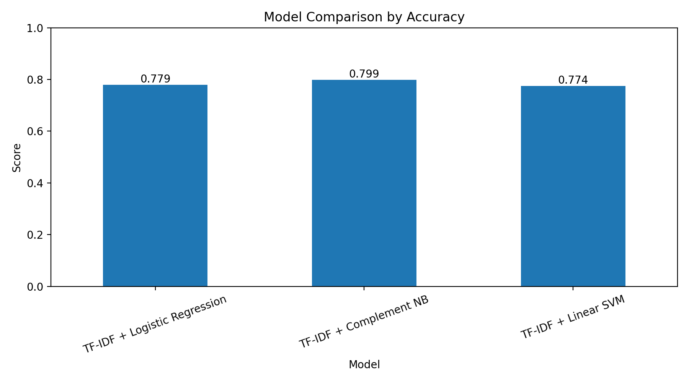
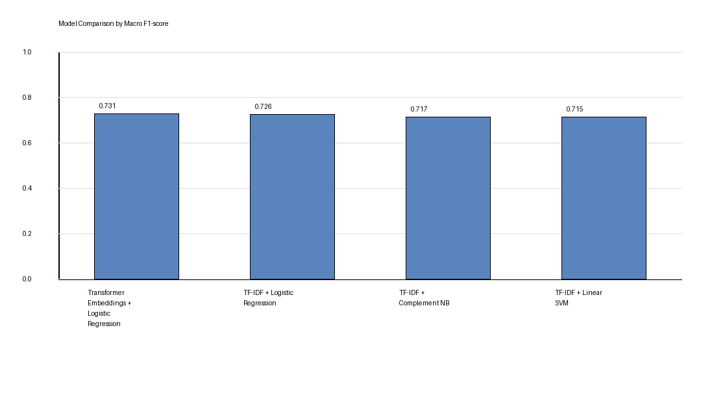
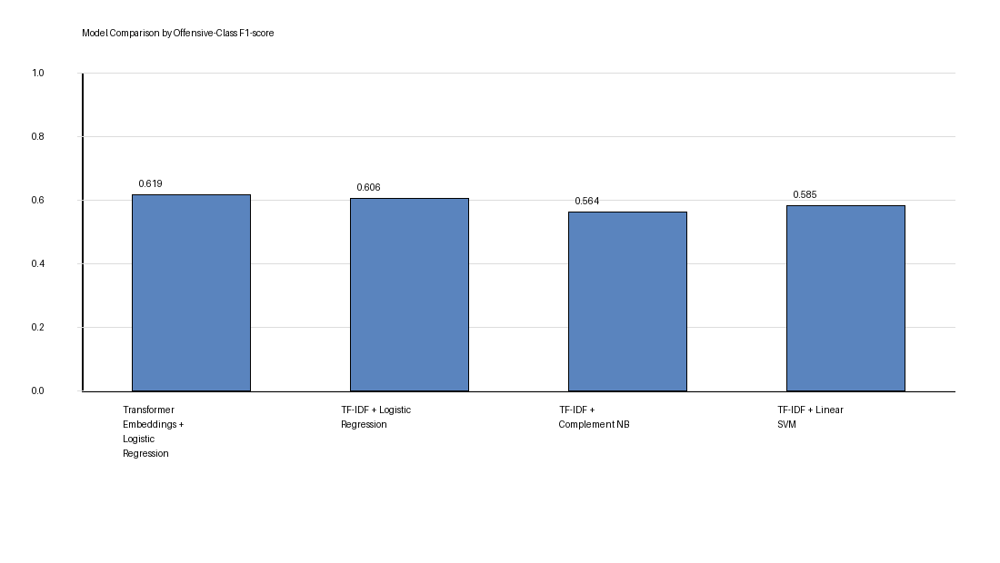
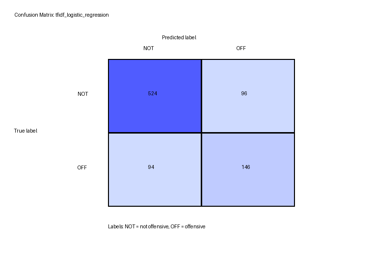
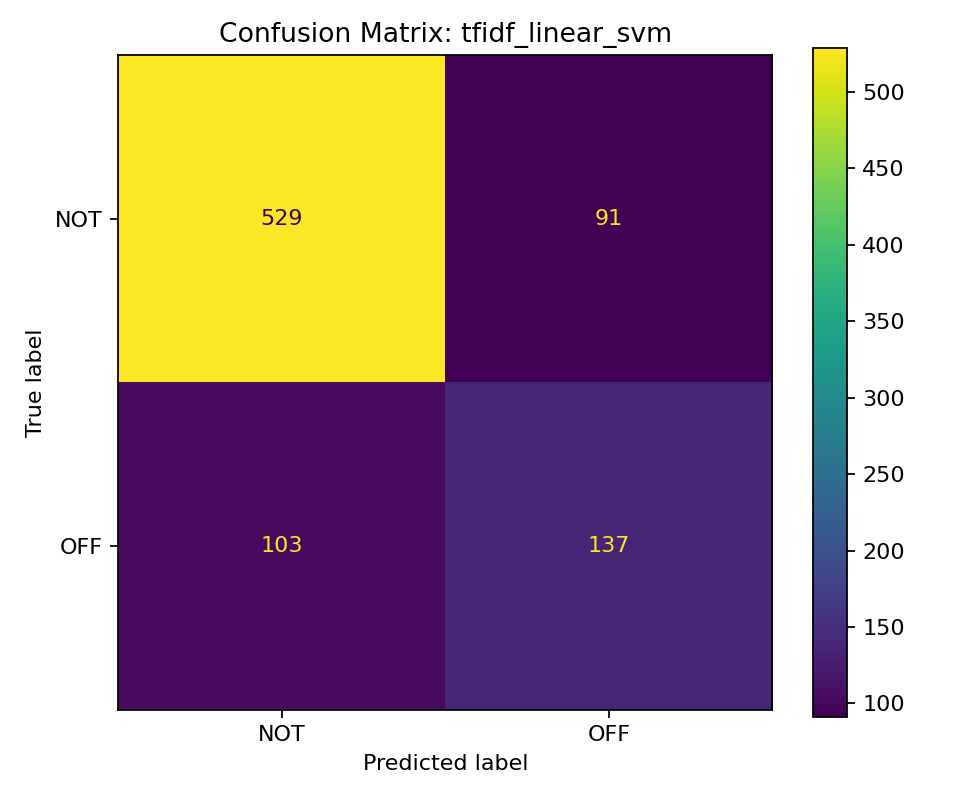
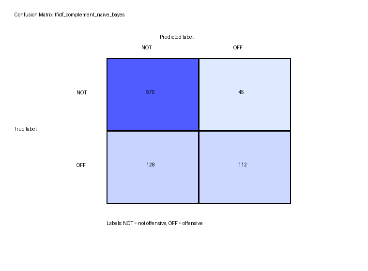

# Offensive Language Detection in Social Media Texts

This project implements an end-to-end machine learning pipeline for offensive language detection in social media texts.

The goal is to classify a text message as one of two classes:

- `NOT` — not offensive
- `OFF` — offensive

The project was developed as a practical Software Engineering / Information Retrieval course project. It follows the full experimental pipeline: dataset collection, preprocessing, text representation, model training, evaluation, reporting, and presentation.

---

## Project Goal

The main research question is:

> How effective are classical machine learning models with TF-IDF text representation for offensive language detection in social media texts?

The project compares several classical machine learning models and evaluates them on the official OLID Level A test set.

---

## Dataset

The project uses the **OLID dataset** from **OffensEval / SemEval 2019**.

The selected task is **Level A binary classification**:

- `NOT` — not offensive
- `OFF` — offensive

Dataset files are **not included** in this repository. They should be downloaded separately from the official OLID source and placed into:

```text
data/raw/
```

Expected files:

```text
data/raw/olid-training-v1.0.tsv
data/raw/testset-levela.tsv
data/raw/labels-levela.csv
```

The official test set is created by joining:

```text
data/raw/testset-levela.tsv
data/raw/labels-levela.csv
```

The generated labeled test file is saved locally as:

```text
data/processed/olid-test-levela-labeled.tsv
```

This generated file is not committed to GitHub.

---

## Methodology

The project pipeline includes:

1. Loading the OLID dataset
2. Preparing the official Level A test set
3. Cleaning and preprocessing text
4. Representing text using TF-IDF
5. Training classical machine learning models
6. Evaluating models using standard classification metrics
7. Saving metrics, confusion matrices, and report-ready assets

---

## Text Preprocessing

For classical machine learning models, the text is cleaned before vectorization.

The preprocessing includes:

- lowercasing
- removing URLs
- removing user mentions
- removing extra spaces
- keeping the pipeline simple and reproducible

Raw text examples are not printed in the terminal output, README, or report assets for ethical and safety reasons.

---

## Text Representation

The project uses **TF-IDF** as the main text representation method.

TF-IDF converts text into numerical features by assigning higher importance to words that are frequent in a document but less frequent across the full dataset.

The implementation uses unigram and bigram features:

```text
ngram_range = (1, 2)
max_features = 50,000
```

---

## Models

The following models were implemented and compared:

1. **TF-IDF + Logistic Regression**
2. **TF-IDF + Linear SVM**
3. **TF-IDF + Complement Naive Bayes**

These models were selected because they are strong classical baselines for text classification and are easy to interpret, reproduce, and evaluate.

---

## Evaluation Metrics

The models were evaluated using:

- Accuracy
- Precision for the offensive class
- Recall for the offensive class
- F1-score for the offensive class
- Macro F1-score
- Confusion matrix

The most important metrics for this task are **Macro F1-score** and **F1-score for the offensive class**, because the dataset is imbalanced and accuracy alone can be misleading.

---

## Final Results

The models were evaluated on the official OLID Level A test set.

The official test set contains:

```text
860 examples
620 NOT
240 OFF
```

| Model | Accuracy | Precision OFF | Recall OFF | F1 OFF | Macro F1 |
|---|---:|---:|---:|---:|---:|
| TF-IDF + Logistic Regression | 0.7791 | 0.6033 | 0.6083 | 0.6058 | 0.7262 |
| TF-IDF + Complement Naive Bayes | 0.7988 | 0.7134 | 0.4667 | 0.5642 | 0.7167 |
| TF-IDF + Linear SVM | 0.7744 | 0.6009 | 0.5708 | 0.5855 | 0.7153 |

Although **Complement Naive Bayes** achieved the highest accuracy, **Logistic Regression** achieved the best Macro F1-score and the best F1-score for the offensive class. Therefore, **TF-IDF + Logistic Regression** was selected as the best model in this experiment.

---

## Visual Results

### Accuracy Comparison



### Macro F1-score Comparison



### Offensive-Class F1-score Comparison



### Logistic Regression Confusion Matrix



### Linear SVM Confusion Matrix



### Complement Naive Bayes Confusion Matrix



---

## Interpretation of Results

The Logistic Regression model achieved the strongest balance between overall performance and offensive-class detection.

Its confusion matrix shows:

```text
Actual NOT correctly classified as NOT: 524
Actual NOT incorrectly classified as OFF: 96
Actual OFF incorrectly classified as NOT: 94
Actual OFF correctly classified as OFF: 146
```

This means that the model correctly detected 146 out of 240 offensive examples.

The Linear SVM model performed similarly, but it detected fewer offensive examples. Complement Naive Bayes achieved higher accuracy, but its recall for the offensive class was lower. This means it missed more offensive texts.

For this reason, Logistic Regression is the most suitable model among the tested classical approaches.

---

## Project Structure

```text
offensive-language-detection/
│
├── data/
│   ├── raw/
│   │   └── .gitkeep
│   ├── processed/
│   │   └── .gitkeep
│   └── README.md
│
├── notebooks/
│   └── 01_offensive_language_detection.ipynb
│
├── reports/
│   ├── assets/
│   │   ├── model_comparison_accuracy.png
│   │   ├── model_comparison_macro_f1.png
│   │   ├── model_comparison_offensive_f1.png
│   │   ├── tfidf_logistic_regression_confusion_matrix.png
│   │   ├── tfidf_linear_svm_confusion_matrix.png
│   │   └── tfidf_complement_naive_bayes_confusion_matrix.png
│   ├── final_report.md
│   ├── final_report_template.md
│   ├── model_comparison_official_test.csv
│   └── presentation_outline.md
│
├── src/
│   ├── __init__.py
│   ├── data_loader.py
│   ├── preprocessing.py
│   ├── evaluate.py
│   ├── prepare_official_test.py
│   ├── train_classical.py
│   ├── plot_final_results.py
│   ├── run_final_experiment.py
│   ├── run_all.py
│   └── train_transformer.py
│
├── requirements.txt
├── .gitignore
└── README.md
```

---

## Installation

Create and activate a virtual environment:

```bash
python -m venv .venv
source .venv/bin/activate
```

Install dependencies:

```bash
pip install -r requirements.txt
```

---

## How to Run

### 1. Download the Dataset

Download the OLID dataset and place the required files in:

```text
data/raw/
```

Required files:

```text
data/raw/olid-training-v1.0.tsv
data/raw/testset-levela.tsv
data/raw/labels-levela.csv
```

### 2. Run the Full Final Experiment

```bash
python -m src.run_final_experiment
```

This command:

1. prepares the official OLID Level A test set
2. trains all classical models
3. evaluates the models
4. saves metrics, confusion matrices, and trained models locally

### 3. Generate Report Assets

```bash
python -m src.plot_final_results
```

This command creates report-ready plots and copies them into:

```text
reports/assets/
```

---

## Outputs

The final experiment creates local output folders:

```text
outputs_final/metrics/
outputs_final/figures/
outputs_final/models/
```

These generated files are not committed to GitHub.

Report-ready assets are stored in:

```text
reports/assets/
```

The final comparison table is stored in:

```text
reports/model_comparison_official_test.csv
```

---

## Reproducibility

The full project can be reproduced with the following sequence:

```bash
python -m src.prepare_official_test
python -m src.train_classical \
  --source local \
  --train_path data/raw/olid-training-v1.0.tsv \
  --test_path data/processed/olid-test-levela-labeled.tsv \
  --text_col tweet \
  --label_col subtask_a \
  --output_dir outputs_final
python -m src.plot_final_results
```

Alternatively, the main experiment can be launched with:

```bash
python -m src.run_final_experiment
```

---

## Ethical Note

This project works with offensive language data. Raw text examples are not printed in terminal output, README, or report assets.

The focus of the project is on:

- statistical analysis
- responsible model evaluation
- text classification methodology
- comparison of machine learning approaches

The project does not reproduce offensive examples in the documentation.

---

## Limitations

The project uses classical machine learning models with TF-IDF representation. These methods are strong baselines, but they do not fully capture deep context, sarcasm, implicit meaning, or complex social language patterns.

Another limitation is class imbalance: the `NOT` class is larger than the `OFF` class. This is why Macro F1-score and offensive-class F1-score were used as important evaluation metrics.

---

## Future Work

Possible future improvements include:

- fine-tuning BERT or DistilBERT
- testing transformer-based contextual embeddings
- improving offensive-class recall
- applying cross-validation
- testing on additional datasets
- adding explainability methods for model decisions

---

## Main Conclusion

Classical machine learning models with TF-IDF representation can provide a solid and reproducible baseline for offensive language detection.

In this experiment, **TF-IDF + Logistic Regression** achieved the best balance between overall performance and offensive-class detection:

```text
Accuracy: 0.7791
Macro F1-score: 0.7262
Offensive-class F1-score: 0.6058
```

Therefore, Logistic Regression was selected as the best classical model in this project.
